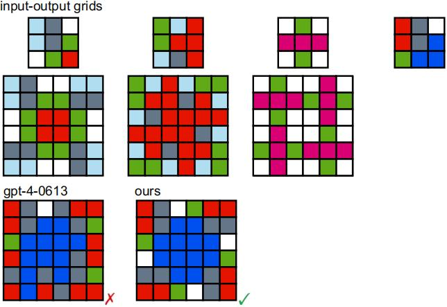
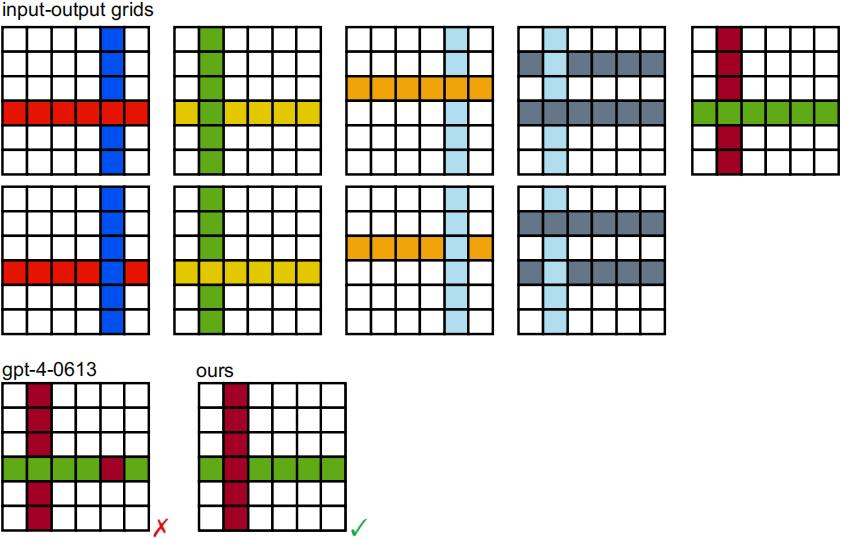
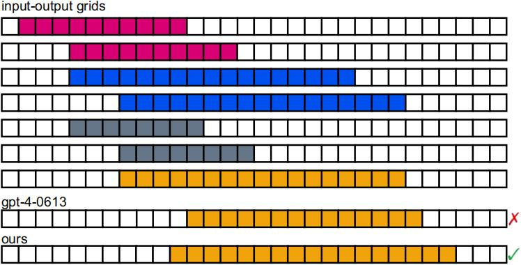
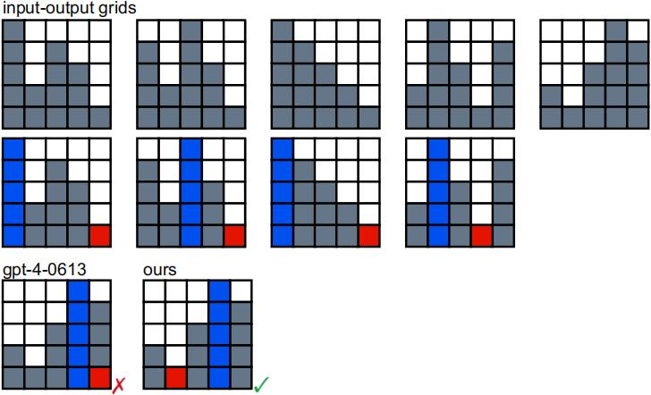

# Improving Abstract Reasoning Ability of Large Language Models through Mixture Program-based Data Synthesis

## Overview

We propose mixture program-based data synthesis strategies for enhancing performance of ARC-like tasks across different levels, including 
- Low-level code-based synthesis (ten meta operations)
- High-level DSL-based synthesis (inspired by [Hodel's Re-arc](https://github.com/michaelhodel/re-arc))
- Shuffle-based synthesis

The generated results across multiple ARC tasks are shown in `logs`.

## Results

|   Model               |  ARC  |   Concept-ARC   |  1D-ARC |  Mini-ARC 
|-----------------------|-------|-----------------|---------|-----------
|   gpt-4-0613          |  113  |      21.0%      |  51.6%  |   24.1%   
|   Ours (Qwen-2.5-7B)  |  185  |      25.6%      |  55.1%  |   20.1%   


## Cases

<p align="center">
   
</p>

<p align="center">
   
</p>

<p align="center">
   
</p>

<p align="center">
   
</p>

## Citation

If you find this repository useful, please consider citing our paper:

```bibtex
@inproceedings{wang-huang-2025-improving,
    title = "Improving Abstract Reasoning Ability of Large Language Models through Mixture Program-based Data Synthesis",
    author = "Wang, Yile  and
      Huang, Hui",
    editor = "Sun, Maosong  and
      Duan, Peiyong  and
      Liu, Zhiyuan  and
      Xu, Ruifeng  and
      Sun, Weiwei",
    booktitle = "Proceedings of the 24th {C}hina National Conference on Computational Linguistics ({CCL} 2025)",
    month = aug,
    year = "2025",
    address = "Jinan, China",
    publisher = "Chinese Information Processing Society of China",
    url = "https://aclanthology.org/2025.ccl-1.69/",
    pages = "904--921",
    abstract = "``Abstract reasoning is a challenging task that involves identifying patterns from limited input-output grids and applying them to new grids. With the development of large language models(LLMs), recent studies attempt to transfer the problems to textual format and tackle abstract reasoning tasks using models such as GPT-4. However, the overall accuracy is still low, which also results in the poor quality of abstract reasoning data directly synthesized by GPT-4, making it unsuitable as effective fine-tuning data. In this paper, we propose mixture program-based data synthesis strategies, including low-level code-based synthesis, high-level DSL-based synthesis,and shuffle-based synthesis. Through these strategies, we construct diverse and valid abstract reasoning instruction data to help improving the general abstract reasoning ability of LLMs for multiple datasets. Experimental results show that, by supervised fine-tuning Qwen-2.5-7B on our synthesized instruction data, the resulting model shows improved abstract reasoning ability and outperforms various strong baseline LLMs, including closed-source model GPT-4 and open-source models such as LLaMA-3 and Qwen-2.5. We release the logs by GPT and our model at https://github.com/szu-tera/ARC.''"
}
```

