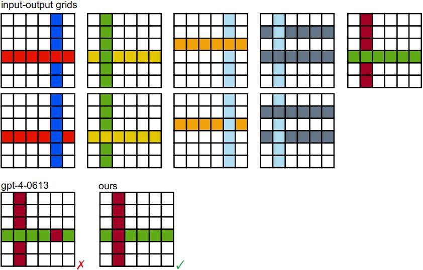

# Improving Abstract Reasoning Ability of Large Language Models through Mixture Program-based Data Synthesis

## Overview

We propose mixture program-based data synthesis strategies for enhancing performance of ARC-like tasks across different levels, including 
- Low-level code-based synthesis (ten meta operations)
- High-level DSL-based synthesis (inspired by [Hodel's Re-arc](https://github.com/michaelhodel/re-arc))
- Shuffle-based synthesis

The generated results across tasks are shown in logs.

## Results

```
+-----------------------+-------+-----------------+---------+-----------+
|   Model               |  ARC  |   Concept-ARC   |  1D-ARC |  Mini-ARC |
+-----------------------+-------+-----------------+---------+-----------+
|   gpt-4-0613          |  113  |      21.0%      |  51.6%  |   24.1%   |
+-----------------------+-------+-----------------+---------+-----------+
|   Ours (Qwen-2.5-7B)  |  185  |      25.6%      |  55.1%  |   20.1%   |
+-----------------------+-------+-----------------+---------+-----------+
```


## Cases

<p align="center">
   
</p>

<p align="center">
   
</p>

<p align="center">
   
</p>

<p align="center">
   
</p>

